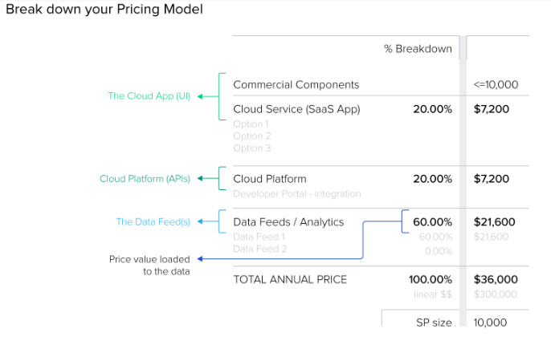
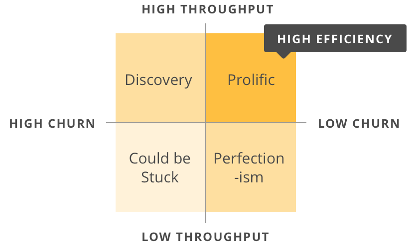
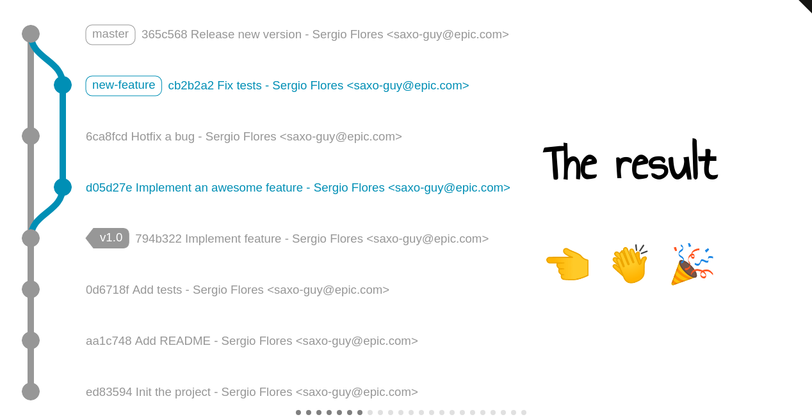

# Contributions
The requirement of contribution is the most important feature of this project. 

## Subject Methods
- Automated (Best for future implementation)  
- Structured  

### Automated
This will require the calculation of contribution 
based on known factors in code creation
i.e Code. ML
- Complexity. 
- Lines of Code lCol
- Approximate time required for implementation (man-hours required).
- Base feature utilization on the grand scheme. *
    - i.e In a situation where the project is a chat app how often does one use the video calls. 
      providing a scale of how useful is the feature to the product at hand.

### Structured Approach
Providing an automated method to calculate code might be quite hard given the number of unknown variables. 
But if possible it should be more efficient than this. 

In this design each project must have a set of price regulators and evaluators.
And developers will be required to use a punch card software/plugin that might require
integration with to evaluate
their working  

- Work done hours.  
- Project manager.  

Cost input.  

##### Sample consider this project.  
It will require project management to handle the pricing of the software. 
And developers to sustain and maintain the project. 
The platform will provide project managers to sign up and apply as for a role in a provided project. 
The developers are the ones to put it to vote on who they require in the team, 
and their capacity to support the manager. 

Managers. Since this is a collaboration platform payments are not based on fixed salaries but rather. 
Developer input.  

[Price Estimation By Project managers or accounts](https://www.toptal.com/product-managers/product-management/software-pricing-strategy-and-architecture)

Now given this is a contribution platform the developers' contribution will be calculated from 
man-hours/total man-hours.

### RoadMap.

### Actions
- View Performance and evaluations
- View Projects
- View Contributions
- View Projects/Bug fix requests
- 

### Features implementation
- Users Account management.
    - Department.
    - Financial reports, earnings based on contributions.  
    - Registration and Editing.
    - GitHub API integration...
    - Host the repo 
- Contributions 
    - Use GitHub API to get required data and store on the platform. 
        - hosting the project it's self is more convenient.
    - Provide retrieved data to project managers for evaluation. 
        - Hours the person worked for. Comparing commit time differences. 
          from issuing the issue to solution. 
        - The changes that were made code or design.
            > SCRUM     Evaluates a developer performance. 
        - lCod
        - diff
    - Process and save project evaluations from the project manager.
        - Developer efficiency
        - Code estimates
            - This is on a branch to branch basis.
    - Provide access control to a repository.
        - Segmented Visibility. 
            - Ability to only see a few sections of code base relevant to the viable task. 
        - Only qualified developers can contribute.
            - The repos are to be private repos. guideliness
                 - API auth http://api.github.com/repos/:owner/:repoName
                    > This is until the platform can implement its own repo manager.  
            - Qualification process
                - Developers have to put out an application request to participate in a given
                 project. 
    - Project management.

> References  
> [Performance Eval, SCRUM](https://pm.stackexchange.com/questions/17514/any-ideas-about-how-to-evaluate-a-developers-performance)  
> [Medium Used in industry](https://medium.com/@yupyork/the-best-developer-performance-metrics-6295ea8d87c0)  
> [PluralSight Matrix](https://www.pluralsight.com/blog/teams/5-developer-metrics-every-software-manager-should-care-about)

1. Lead Time  
Estimated timelines
2. Code Churn 
Added and deleted code.
[churn sample project](https://github.com/danmayer/churn)
3. Impact
This is the number of code changes done in consideration of number of files updated and lCod changes
git --diff
4. Active days
This will display the active times an :owner made changes to :repo
https://api.github.com/Users/:owner/:repo/stats/punch_card.
5. Efficiency
Ability to contribute code that is productive. 

- User registration
    - Personal details including a viable CV. 
    - Account mn
    
- Since Contributions and competence might require a lot of human interaction due to lack of a stable 
and consistent software pricing methodologies. The platform should only provide access to required 
data. 

# Important Links
[Program](https://buildforsdg.andela.com/program)
[Timelines]()
[Success Guidelines](https://drive.google.com/file/d/1G4y8-V2UyX2nNMdg2T6wh6rglruvW61k/view)
[GitHub Integration Rules](https://docs.google.com/presentation/d/1hvnwv76gX98nAAgTxJp47CremzwPkfzDkXgejQGz2l0/edit#slide=id.p1)

[Git Objects](https://youtu.be/1_LFectmOTw)

## Libraries Used
[Git Graph](https://gitgraphjs.com)

[git2Object](https://github.com/fabien0102/git2json)

How the project earns
- Sales per app.
- Hosting and tooling plans.
- Project management capacity.
Since you cannot guarantee the success of projects leniency has to be provided in terms of earnings. 
To encourage project collaborators. To access the platform.

